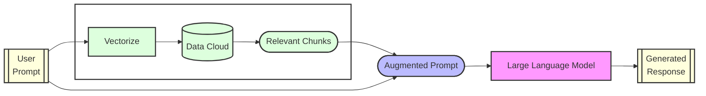

```mermaid
flowchart LR
    Prompt[["User
    Prompt"]]
    RET_Vectorize[Vectorize]
    RET_Search[(Data Cloud)]
    RET_Chunks([Relevant Chunks])
    AUG_AugmentedPrompt([Augmented Prompt])
    GEN_LLM[Large Language Model]
    Response[["Generated
    Response"]]

    subgraph RAG_Retrieval[" "]
        direction TB
        RET_Vectorize --> RET_Search
        RET_Search --> RET_Chunks
    end

    Prompt --> RET_Vectorize
    RET_Chunks --> AUG_AugmentedPrompt
    Prompt --> AUG_AugmentedPrompt
    AUG_AugmentedPrompt --> GEN_LLM
    GEN_LLM --> Response

    classDef process fill:#f9f,stroke:#333,stroke-width:2px;
    class GEN_LLM process;

    classDef data fill:#dfd,stroke:#333,stroke-width:2px;
    class RET_Vectorize,RET_Search,RET_Chunks data;

    classDef augmentedPrompt fill:#bbf,stroke:#333,stroke-width:2px;
    class AUG_AugmentedPrompt augmentedPrompt;

    classDef chunks fill:#fee,stroke:#333,stroke-width:2px;

    classDef endPoints fill:#ffd,stroke:#333,stroke-width:2px;
    class Prompt endPoints;
    class Response endPoints;

    classDef bigBoxes fill:#fff,stroke:#333,stroke-width:2px;
    class RAG_Retrieval bigBoxes;
```
