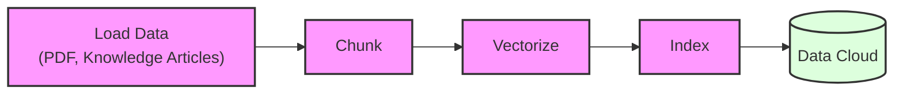

```mermaid
flowchart LR
        PRE_Load["Load Data
        (PDF, Knowledge Articles)"]
        --> PRE_Chunk[Chunk]
        --> PRE_Vectorize[Vectorize]
        --> PRE_Index[Index]
        --> PRE_Store[(Data Cloud)]

    classDef process fill:#f9f,stroke:#333,stroke-width:2px;
    class PRE_Load,PRE_Chunk,PRE_Vectorize,PRE_Index process;

    classDef data fill:#dfd,stroke:#333,stroke-width:2px;
    class PRE_Store data;
```
