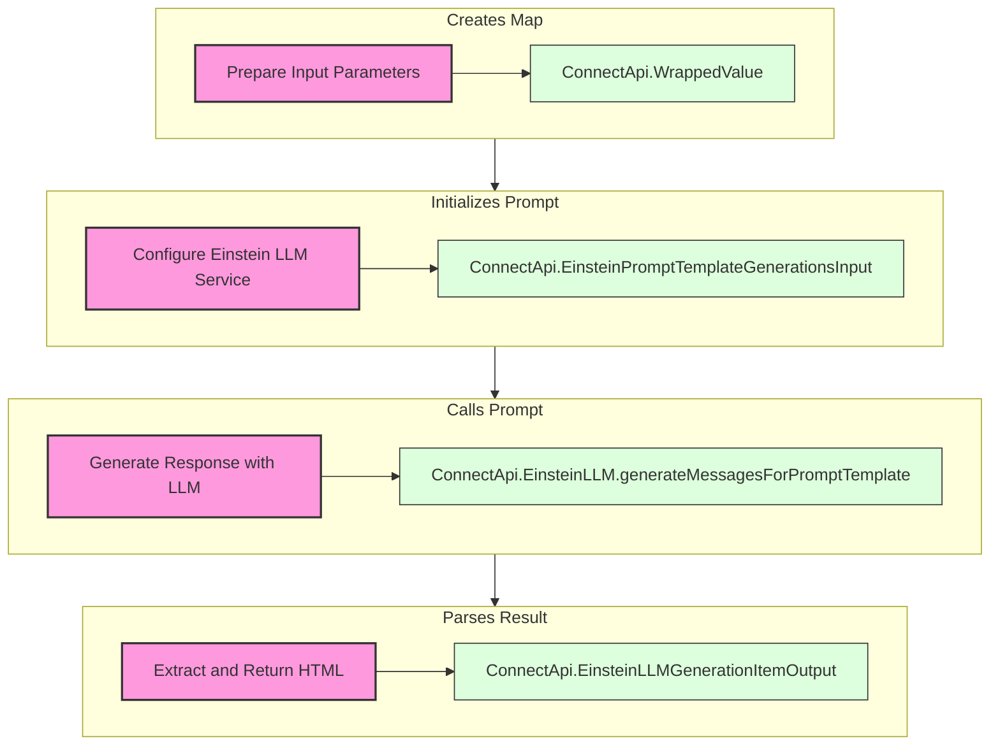

```mermaid
flowchart TD
    M1[Prepare Input Parameters]
    M2[Configure Einstein LLM Service]
    M3[Generate Response with LLM]
    M4[Extract and Return HTML]
    EWV[ConnectApi.WrappedValue]
    EIn[ConnectApi.EinsteinPromptTemplateGenerationsInput]
    EOut[ConnectApi.EinsteinLLMGenerationItemOutput]
    EGen[ConnectApi.EinsteinLLM.generateMessagesForPromptTemplate]

    subgraph SG1[Creates Map]
        direction LR
        M1 --> EWV
    end
    subgraph SG2[Initializes Prompt]
        direction LR
        M2 --> EIn
    end
    subgraph SG3[Calls Prompt]
        direction LR
        M3 --> EGen
    end
    subgraph SG4[Parses Result]
        direction LR
        M4 --> EOut
    end

    SG1 --> SG2 --> SG3 --> SG4

    classDef main fill:#f9d,stroke:#333,stroke-width:2px
    classDef einstein fill:#dfd,stroke:#333,stroke-width:1px

    class M1,M2,M3,M4 main
    class EWV,EIn,EOut,EGen einstein

```
